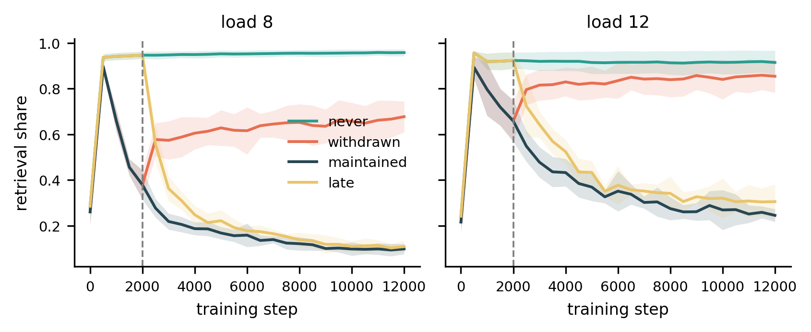

# Same Behaviour, Different Causal Route

Code for **"Same Behaviour, Different Causal Route: Post-Convergence Steering in
Recurrent–Attention Hybrids"** (ICLR 2027 submission, anonymous).

Once a model has learned a task, can its computation change without changing its behaviour?
We study recurrent–attention hybrids in which recurrent state and attention retrieval can both
support the same answer. After accuracy has converged, we put a price on the retrieval route and
ask whether causal reliance moves to recurrence while behaviour stays the same.

<p align="center">
  
</p>
<p align="center"><sub>Symbolic four-arm switch (§4.1). Pricing retrieval after step 2000 (<i>late</i>)
ends at almost the same retrieval share as pricing it from the start (<i>maintained</i>); withdrawing
the price lets retrieval return.</sub></p>

## Main findings

- **Steering works after convergence.** Pricing retrieval shifts causal reliance to recurrence
  while endpoint accuracy is preserved. Unpriced controls do not drift, inference-time
  attenuation to the same retrieval share collapses accuracy, and a no-penalty availability
  intervention produces the same rerouting, so this is learned reorganisation rather than
  output shrinkage.
- **The receiving route must be able to solve the task.** A recurrent-only capability screen,
  fixed before steering, predicts which conditions hand over. At 19.77M parameters, 3/3 seeds
  hand over at the viable load and 0/3 at the non-viable one. On MNIST and CIFAR-10 the split is
  8/8 against 0/8.
- **After handover, retrieval can be deleted.** A model that has handed over loses no accuracy
  when its retrieval route is removed, which replaces retrieval state that grows with the
  context by recurrent state of constant size.
- **Language modelling is a boundary case.** On TinyStories, where copying has no recurrent
  substitute, pricing transfers a stable part of retrieval's function (*h* ≈ 0.39), but
  retrieval never becomes deletable.

## Repository layout

```text
experiments/
  core/                    symbolic suite: setup, metrics, pricing, most main-text results
  visual/                  MNIST and CIFAR-10 eight-seed replications
  large_scale/             19.77M-parameter boundary test and route deletion
  appendix_d_mqar/         fused MQAR hybrid
  appendix_e_falcon_h1/    pretrained Falcon-H1 route measurement
  appendix_f_mamba2/       pretrained Mamba-2 boundary and resampling diagnostic
  appendix_g_fusion/       non-additive / pre-fusion readouts
  appendix_n_attribution/  attribution-proxy crossing offsets
  appendix_o_gpt2_ioi/     pretrained GPT-2 IOI measurement check
  appendix_p_controls/     steering baselines and CRAM-style fidelity check
  appendix_q_worm_vsr/     pretrained WorM VSR route-availability diagnostic
  majority/                Majority task (Appendix R)
  tinystories_lm/          TinyStories language model (Appendix S); self-contained, ships its logs
  pilots/                  exploratory and superseded notebooks; no paper result depends on them
docs/
  PAPER_CODE_MAP.md        every section, table and appendix -> the file that produces it
  REPRODUCIBILITY_AUDIT.md what is verified, what is not, and open paper/code mismatches
figures/                   figures supplied with the runs
results/                   reported values preserved for experiments without code
```

## Quick start

```bash
git clone https://github.com/shadi97kh/SAME-BEHAVIOUR-DIFFERENT-CAUSAL-ROUTE.git
cd SAME-BEHAVIOUR-DIFFERENT-CAUSAL-ROUTE
pip install -r requirements.txt
```

### Check a result on CPU in under a minute

The TinyStories extension ships the evaluation logs of all 29 of its runs. This command
rebuilds its tables and figure from those logs and compares every reported number with the
paper:

```bash
cd experiments/tinystories_lm
python analyze.py --out results --check     # ends with "All checks passed."
```

### Re-run the training experiments (GPU)

Open a notebook and run it top to bottom. Each notebook chooses its scale with a `PRESET`
variable at the top. Start with `PRESET = "smoke"`, which runs in minutes and checks the
pipeline, then switch to `"full"` to reproduce the paper numbers. Most notebooks also have a
`RUN` dictionary that turns individual experiment blocks on and off.

| Experiment | Paper | Entry point |
| --- | --- | --- |
| Symbolic suite | §3–§6, App A, H–M | `experiments/core/symbolic_main.ipynb` |
| MNIST / CIFAR-10 replications | §4.3, §4.5, App C | `experiments/visual/{mnist,cifar10}_replication_8seed.ipynb` |
| Large-scale boundary test and deletion | §4.2, App B | `experiments/large_scale/large_scale_boundary_clean.ipynb` |
| Fused MQAR | App D | `experiments/appendix_d_mqar/hybrid_mqar.ipynb` |
| Pretrained Falcon-H1 / Mamba-2 | App E, F | `experiments/appendix_e_falcon_h1/`, `experiments/appendix_f_mamba2/` |
| Fusion rules | §5.5, App G | `experiments/appendix_g_fusion/prefusion_check.ipynb` |
| Attribution / GPT-2 IOI | App N, O | `experiments/appendix_n_attribution/`, `experiments/appendix_o_gpt2_ioi/` |
| Steering baselines | App P | `experiments/appendix_p_controls/` |
| Pretrained WorM VSR | App Q | `experiments/appendix_q_worm_vsr/` |
| Majority task | App R | `experiments/majority/majority_handover.ipynb` |
| TinyStories language model | App S | `experiments/tinystories_lm/` (scripts + notebook) |

[`docs/PAPER_CODE_MAP.md`](docs/PAPER_CODE_MAP.md) goes down to the notebook block that
produces each result.

## Data, storage and compute

- **Data.** Symbolic tasks are generated online from fixed seeds, so no dataset is bundled.
  On first use the notebooks download public data and models: MNIST and CIFAR-10
  (torchvision), WikiText-2 and TinyStories (Hugging Face), GPT-2, Falcon-H1, Mamba-2, and the
  WorM pretrained checkpoints. Model checkpoints are not committed.
- **Storage.** Notebooks write append-only JSONL/CSV stores and rebuild every table and figure
  from them, so an interrupted run resumes instead of retraining. Results go to `results/` by
  default; set `RESULTS_DIR` to put them elsewhere.
- **Compute.** The paper runs used a single NVIDIA Tesla T4 with Python 3.12 and PyTorch 2.10.
  The symbolic suite takes 14.4 GPU-hours, Majority about 1.2 and TinyStories about 17.6.
  Smoke presets run in minutes.
- **Mamba-2 only.** Appendix F needs GPU builds of `mamba-ssm` and `causal-conv1d`
  (see `requirements.txt`).

## Reproducibility status

The notebooks are released **without saved outputs**, so the only way to confirm a number is to
re-run the notebook that produces it. `experiments/tinystories_lm/` is the exception: its logs
are included and its 20 checks pass against them.

[`docs/REPRODUCIBILITY_AUDIT.md`](docs/REPRODUCIBILITY_AUDIT.md) lists the places where the
released code and the manuscript still differ (for example, the fusion notebook's default
price and step count, and seed counts in two appendices). Three baselines in the Appendix P
comparison (delayed attention, weight decay, and the L1 retrieval penalty) have no code here.
Their reported values are kept, with provenance, in `results/appendix_p/table22_reported.csv`.

## Citation

```bibtex
@inproceedings{same_behaviour_different_route,
  title     = {Same Behaviour, Different Causal Route: Post-Convergence Steering in
               Recurrent--Attention Hybrids},
  author    = {Anonymous},
  booktitle = {Submitted to the International Conference on Learning Representations (ICLR)},
  year      = {2027}
}
```

## License

MIT. See [`LICENSE`](LICENSE).
